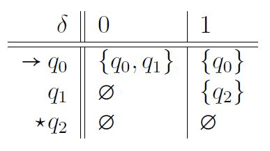
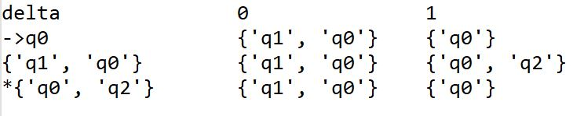
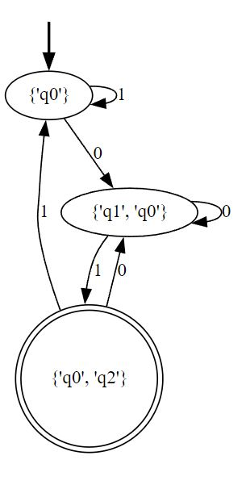

# NFA-to-DFA
Transform a given NFA to a DFA and output its transition table and diagram

## How It Is Done
We write a Python program that takes as input the transition table for an NFA A, and outputs the transition table and diagram for a DFA B, such that L(A) = L(B).

## Results
This program works for any given transition table in the required format. For demonstration, the following table was given as input:

After transforimg the NFA to a DFA we will have:

Which has the following diagram:

